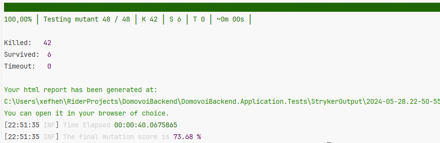
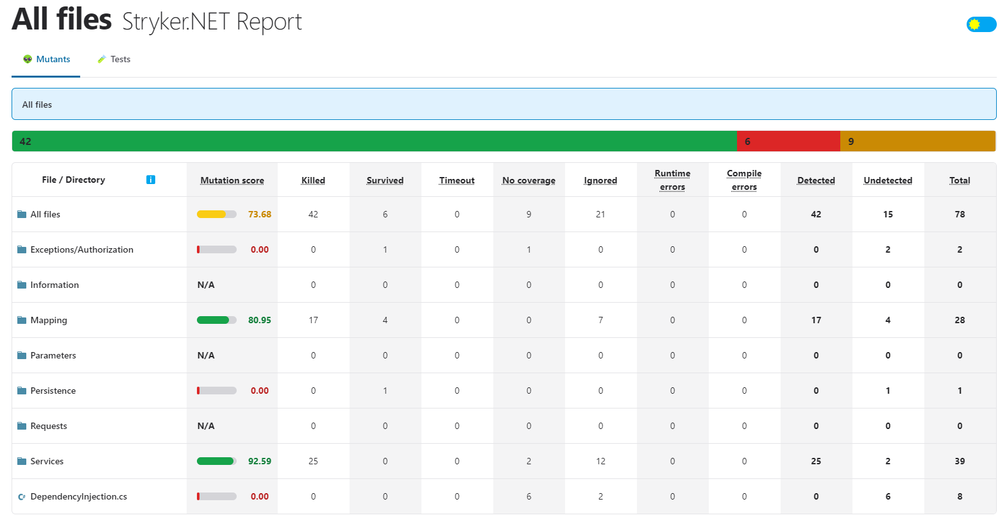

# МУТАНЦИОННОЕ ТЕСТИРОВАНИЕ

## Использовано:
- NUNIT - Фреймворк для тестирования .NET;
- Stryker Mutator - Библиотека для мутанционного тестирования;

### Отчёты храняться в директории: [/Отчёты (МУТАНТЫ)](https://github.com/NikitaVologin/DomovoiBackend/tree/mutation-tests/Отчёты%20(МУТАНТЫ))

### Отчёт после выполнения мутанционного тестирования:

### HTML Отчёт (Подробнее в папки выше):
