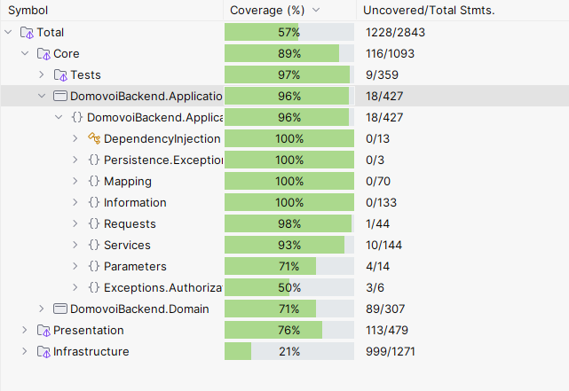

## ПЕРЕЙТИ НА ТЕСТИРОВАНИЕ МУТАНТАМИ: [ПЕРЕЙТИ](https://github.com/NikitaVologin/DomovoiBackend/tree/mutation-tests)

# НАВИГАЦИЯ:
### - [Список строковых литералов для объявления type (ВАЖНО)](#список-строковых-литералов-для-объявления-type)
- [1. Таблица реализованного и в процессе (основные действия)](#1-таблица-реализованного-и-в-процессе-основные-действия)
- [2. Тестирование](#2-тестирование)
  - [2.1. Модульное тестирование.](#21-модульное-тестирование)
    - [2.1.1. Слой Application.](#211-слой-application)
  - [2.2. Функциональное (end-to-end) тестирование.](#22-функциональное-end-to-end-тестирование)
    - [2.2.1. Endpoints  - Контрагенты.](#221-endpoints---контрагенты)
    - [2.2.2. Endpoints - Объявления.](#222-endpoints---объявления)
- [3. Информация об контейнерах.](#3-информация-об-контейнерах)
- [4. Информации для запросов/ответов](#4-информации-для-запросовответов)
  - [4.1. Deals Information (Информация о сделках).](#41-deals-information-информация-о-сделках)
    - [4.1.1. RentInformation ("type" = "Rent").](#411-rentinformation-type--rent)
    - [4.1.2. SellInformation ("type" = "Sell").](#412-sellinformation-type--sell)
  - [4.2. CounterAgent Information(Информация о контр-агентах).](#42-counteragent-informationинформация-о-контр-агентах)
    - [4.2.1 PhysicalCounterAgentInfo ("type" = "Physical").](#421-physicalcounteragentinfo-type--physical)
    - [4.2.2. LegalCounterAgentInfo ("type" = "Legal").](#422-legalcounteragentinfo-type--legal)
  - [4.3. Reality Information (Информация о недвижимостях).](#43-reality-information-информация-о-недвижимостях)
     - [4.3.1. Commercial Realities Information (Информация о коммерческих недвижимостях).](#431-commercial-realities-information-информация-о-коммерческих-недвижимостях)
       - [4.3.1.1. OfficeInformation ("type" = "Office")](#4311-officeinformation-type--office)
     - [4.3.2. Living Realities Information (Информация о жилих недвижимостях).](#432-living-realities-information-информация-о-жилих-недвижимостях)
       - [4.3.2.1. FlatInformation ("type" = "Flat").](#4321-flatinformation-type--flat) 
  - [4.4. AnnouncementInformation.](#44-announcementinformation)
- [5. Запросы.](#5-запросы)
  - [5.1. Контр-агенты.](#51-контр-агенты)
    - [5.1.1. Создание нового контр-агента](#511-создание-нового-контр-агента)
    - [5.1.2. Логин.](#512-логин)
    - [5.1.3. Удалить пользователя.](#513-удалить-пользователя)
    - [5.1.4. Обновить пользователя пользователя.](#514-обновить-пользователя-пользователя)
    - [5.1.5. Получить пользователя по Id](#515-получить-пользователя-по-id)
  - [5.2. Объявления.](#52-объявления)
    - [5.2.1. Получить объявление по Id.](#521-получить-объявление-по-id)
    - [5.2.2. Получить первые N обявлений.](#522-получить-первые-n-обявлений)
    - [5.2.3. Загрузить объявление.](#523-загрузить-объявление)
    - [5.2.4. Получить объявление по параметрам (ФИЛЬТР).](#524-получить-объявления-попараметрам)
    - [5.2.5. Удалить объявление.](#525-удалить-объявление)
    - [5.2.6. Обновить объявление.](#526-обновить-объявление)
    - [5.2.7. Получить объявление (с по по).](#527-получить-объявления-по-параметрам-с---по)
    - [5.2.8. Получить объявления пользователя.](#528-получить-объявления-пользователя)

# Список строковых литералов для объявления type:
### Reality (Недвижимость):
- **"Office"** - офис,
- **"Flat"** - квартира,
### Deal (Сделки):
- **"Rent"** - аренда,
- **"Sell"** - продажа
### CounterAgents (Контр-Агенты):
- **"Legal"** - юр. лицо,
- **"Physical"** - физ. лицо;

# 1. Таблица реализованного и в процессе (основные действия):

| Сущность                               | XML-Документация | Response-Request Infos | Конфигурация БД |
|----------------------------------------|------------------|------------------------|-----------------|
| Контр-Агенты                           |                  |                        |                 |
| Физическое лицо (PhysicalCounterAgent) | Done             | Done                   | Done            |
| Юридическое лицо (LegalCounterAgent)   | Done             | Done                   | Done            |
| Сделки                                 |                  |                        |
| Аренда (Rent)                          | Done             | Done                   | Done            |
| Условия Аренды (RentConditions)        | Done             | Done                   | Done            |
| Правила Аренды (RentRules)             | Done             | Done                   | Done            |
| Продажа (Sell)                         | Done             | Done                   | Done            |
| Условия продажи (SellConditions)       | Done             | Done                   | Done            |
| Описание Продажи (SellFeatures)        | Done             | Done                   | Done            | 
| Коммерческая недвижимость              |                  |                        |
| Офис                                   | Done             | Done                   | Done            |
| Жилая недвижимость                     |                  |                        | 
| Квартира                               | Done             | Done                   | Done            |


# 2. Тестирование.
## Количество тестов:
- Модульные тесты: **40** (Тестирование всего функционала Service классов + **база для модульных тестов**);
- Интеграционные тесты: **37** (Тестирование ответа веб-сервисов на EndPoint от начала до конца - end to end);
## Покрытие тестами (dotCover):


## 2.1. Модульное тестирование.

### 2.1.1. Слой Application:

| CounterAgentService | Статус Покрытия |
|---------------------|-----------------|
| Add (Регистрация)   | 100% ✅          |
| Login               | 100% ✅          |
| Update              | 100% ✅          |
| Remove              | 100% ✅          |
| Get (По GUID)       | 100% ✅          |

| AnnouncementService                       | Статус Покрытия |
|-------------------------------------------|-----------------|
| Add                                       | 100% ✅          |
| Get (По GUID)                             | 100% ✅          |
| Get (Все)                                 | 100% ✅          |
| Get с ограничениями (с индекса по индекс) | 100% ✅          |
| Update                                    | 100% ✅          |
| Get до индекса (не использовать, старьё)  | 100% ✅          |
| Get с ограничениями (до индекса, новый)   | 100% ✅          |
| Remove                                    | 100% ✅          |
| Get по GUID пользователя                  | 100% ✅          |
| Get с фильтрацией                         | 100% ✅          |


### 2.2. Функциональное (end-to-end) тестирование:
<b>НЕОБХОДИМО:</b> ЗАПУЩЕННЫЙ DOCKER ENGINE!!! (ТЕСТИРОВАНИЕ ИДЁТ НА ОСНОВЕ ОБРАЗА POSTGRESQL)

<b>ВАЖНО:</B> КАЖДЫЙ ТЕСТ ДОЛЖЕН БЫТЬ ЗАПУЩЕН ПО ОТДЕЛЬНОСТИ (ЧТОБЫ НЕ СОЗДАВАТЬ ОШИБКИ-ТЕСТОВ)

КАЖДЫЙ ФУНКЦИОНАЛЬНЫЙ ТЕСТ НАЗЫВАЕТСЯ В ФОРМАТЕ <b>Api_{Name}</b>.

### 2.2.1. Endpoints  - Контрагенты
| Endpoint                           | Покрытие |
|------------------------------------|----------|
| [POST] /CounterAgent (Регистрация) | 100% ✅   |
| [POST] /CounterAgent/Login         | 100% ✅   |
| [GET] /CounterAgent/{id}           | 100% ✅   |
| [DELETE] /CounterAgent/{id}        | 100% ✅   |
| [PUT] /CounterAgent/{id}           | 100% ✅   |

### 2.2.2. Endpoints - Объявления
| Endpoint                                                         | Покрытие |
|------------------------------------------------------------------|----------|
| [POST] /Announcement/                                            | 100% ✅   |
| [GET] /Announcement/Take/{count} (Бери другой Take, этот мёртв)  | 100% ✅   |
| [GET] /Announcement/{id}                                         | 100% ✅   |
| [GET] /Announcement/Take?fromIndex={fromIndex}&toIndex={toIndex} | 100% ✅   |
| [DELETE] /Announcement/{counterAgentId}/{announcementId}         | 100% ✅   |
| [PUT] /Announcement/{id}                                         | 100% ✅   |
| [GET] /Announcement/User/{id}                                    | 100% ✅   |
| [GET] /Announcement/Filtered?...                                 | 100% ✅   |


# 3. Информация об контейнерах.

| Адрес                                    | Название    |
|------------------------------------------|-------------|
| http://localhost:8181/swagger/index.html | swagger     |
| http://localhost:8181                    | Приложение  |
| http://localhost:5051                    | pgAdmin     |

pgAdmin:
1. Email: admin@admin.com
2. Password: 123

# 4. Информации для запросов/ответов:
## 4.1. Deals Information (Информация о сделках):
### 4.1.1. RentInformation ("type" = "Rent"):

```json
{
  "conditions": {
    "price": 0,
    "period": "string",
    "deposit": 0,
    "communalPays": 0,
    "prepay": 0,
    "facilities": "string",
    "withKids": false,
    "withAnimals": false,
    "canSmoke": false
  },
  "type": "string"
}
```
### 4.1.2. SellInformation ("type" = "Sell"):
```json
{
  "conditions": {
    "price": 0,
    "type": "string",
    "yearsInOwn": 0,
    "ownersCount": 0,
    "prescribersCount": 0,
    "haveChildOwners": false,
    "haveChildPrescribers": false
  },
  "type": "string"
}
```
## 4.2. CounterAgent Information(Информация о контр-агентах):

### 4.2.1 PhysicalCounterAgentInfo ("type" = "Physical"):
```json
{
  "id": "guid",
  "contactNumber": "string",
  "fio": "string",
  "type": "string"
}
```
### 4.2.2. LegalCounterAgentInfo ("type" = "Legal")
```json
{
  "id": "guid",
  "contactNumber": "string",
  "name": "string",
  "tin": "string",
  "type": "string"
}
```

## 4.3. Reality Information (Информация о недвижимостях):
### 4.3.1. Commercial Realities Information (Информация о коммерческих недвижимостях):

### 4.3.1.1. OfficeInformation ("type" = "Office"):
```json
{
  "area": 0,
  "floorsCount": 0,
  "entry": "string",
  "address": "string",
  "isUse": false,
  "access": "string",
  "building": {
    "class": "string",
    "buildingYear": 0,
    "centerName": "string",
    "haveParking": false,
    "isEquipment": false
  },
  "name": "string",
  "roomsCount": 0,
  "type": "string"
}
```
### 4.3.2. Living Realities Information (Информация о жилих недвижимостях):

### 4.3.2.1. FlatInformation ("type" = "Flat"):
```json
{
  "isFresh": true,
  "roomsCount": 0,
  "isRepaired": true,
  "kitchenArea": 0,
  "balconyType": "string",
  "viewFromBalcony": "string",
  "address": "string",
  "floor": 0,
  "floorsCount": 0,
  "area": 0,
  "building": {
    "buildingYear": 0,
    "type": "string",
    "ceilingHeight": 0,
    "isGas": true,
    "haveGarbageChute": true,
    "isSecurity": true,
    "haveParking": true,
    "infrastructures": [
      "string", "string"
    ],
    "landscaping": [
      "string", "string"
    ]
  },
  "type": "string"
}
```

## 4.4. AnnouncementInformation:
```json
{
  "id": "guid",
  "description": "string",
  "connectionType": "string",
  "dealInfo": {
    // Тело Конкретного Deal-Info.
  },
  "realityInfo": {
    // Тело Конкретного Reality.
  },
  "counterAgentInfo": {
    // Тело Конкретного Counter-Agent.
  }
}
```

# 5. Запросы.
# 5.1. Контр-агенты:

## 5.1.1. Создание нового контр-агента:
Endpoint: [POST] /CounterAgent/ (типы перечислены выше вместе с информацией).

Тело запроса:
```json
{
  "email": "string",
  "password": "string"
}
```

Ответ: [Конкретный Information (перечислены выше, НАЖМИТИ ДЛЯ ПЕРЕХОДА)](#42-counteragent-informationинформация-о-контр-агентах);

## 5.1.2. Логин:
Endpoint: [POST] /CounterAgent/Login

Тело запроса:
```json
{
  "email": "string",
  "password": "string"
}
```
Ответ: [Конкретный Information (перечислены выше, НАЖМИТИ ДЛЯ ПЕРЕХОДА)](#42-counteragent-informationинформация-о-контр-агентах);

## 5.1.3. Удалить пользователя
Endpoint: [DELETE] /CounterAgent/{id:guid}

| Параметр | Тип  | Описание                                                     |
|----------|------|--------------------------------------------------------------|
| id       | Guid | Guid пользователя, которого нужно удалить (**ОБЯЗАТЕЛЬНЫЙ**) |

## 5.1.4. Обновить пользователя пользователя
Endpoint: [PUT] /CounterAgent/{id:guid}

| Параметр | Тип  | Описание                                                      |
|----------|------|---------------------------------------------------------------|
| id       | Guid | Guid пользователя, которого нужно обновить (**ОБЯЗАТЕЛЬНЫЙ**) |

Тело запроса: 
```json
{
  "contactNumber": "контактный номер",
  "email": "email",
  "password": "password",
  // ОСТАЛЬНЫЕ ПОЛЯ АНАЛОГИЧНЫ ПОЛЯМ ИЗ ИНФОРМАЦИИ (Включая "type")
}
```

## 5.1.5. Получить пользователя по Id:

Endpoint: [GET] /CounterAgent/{id:guid}

| Параметр | Тип  | Описание                                                      |
|----------|------|---------------------------------------------------------------|
| id       | Guid | Guid пользователя, которого нужно получить (**ОБЯЗАТЕЛЬНЫЙ**) |

# 5.2. Объявления.

## 5.2.1. Получить объявление по Id
Endpoint [GET] /Announcement/{id:guid}

| Параметр | Тип  | Описание                                                    |
|----------|------|-------------------------------------------------------------|
| id       | Guid | Guid объявления, которого нужно получить (**ОБЯЗАТЕЛЬНЫЙ**) |

Ответ: [AnnouncementInfo (указано выше, НАЖМИТЕ ЧТОБЫ ПЕРЕЙТИ)](#44-announcementinformation).

## 5.2.2. Получить первые N обявлений (НЕ ИСПОЛЬЗОВАТЬ):
Endpoint [GET] /Announcement/Take/{count}

| Параметр | Тип | Описание                                                   |
|----------|-----|------------------------------------------------------------|
| count    | int | Количество первых полученных объявлений (**ОБЯЗАТЕЛЬНЫЙ**) |

Ответ:
Поле с массивом
```json
{
  "announcementInformation": [ {
      // Конкретный announcementInformation
    }
  ]
}
```
[AnnouncementInfo (указано выше, НАЖМИТЕ ЧТОБЫ ПЕРЕЙТИ)](#44-announcementinformation).

## 5.2.3. Загрузить объявление.
Endpoint [POST] /Announcement/ (Типы перечислены выше вместе с Info);

- [ТИПЫ СДЕЛОК, (КЛИКАБЕЛЬНО)](#44-announcementinformation)
- [ТИПЫ НЕДВИЖИМОСТИ, (КЛИКАБЕЛЬНО)](#43-reality-information-информация-о-недвижимостях)


Запрос:
```json
{
  "description": "string",
  "connectionType": "string",
  "dealInfo": {
    // Тело Конкретного Deal-Info.
  },
  "realityInfo": {
    // Тело Конкретного Reality.
  },
  "counterAgentId": "GUID"
}
```

Ответ: Guid добавленного объявления.

## 5.2.4. Получить объявления по параметрам:
Endpoint [GET] /Announcement/Filtered? (Параметры будут описаны ниже)


| Параметр    | Тип                 | Описание                                                                                                                |
|-------------|---------------------|-------------------------------------------------------------------------------------------------------------------------|
| DealType    | string              | Название типа сделки (перечислены в строковых литералах) (**НЕ ОБЯЗАТЕЛЬНЫЙ**)                                          |
| PriceStart  | number              | Стартовая цена (**НЕ ОБЯЗАТЕЛЬНЫЙ**)                                                                                    |
| PriceEnd    | number              | Конечная цена (**НЕ ОБЯЗАТЕЛЬНЫЙ**)                                                                                     |
| RealityType | string              | Название типа недвижимости (перечислены в строковых литералах) (**НЕ ОБЯЗАТЕЛЬНЫЙ**)                                    |
| FloorFilter | 0 или 1 или 2 или 3 | Фильтр по этажам: 0 - Без разницы, 1 - Не первый, 2 - Не последний, 3 - Не последний и не первыйх (**НЕ ОБЯЗАТЕЛЬНЫЙ**) |

Ответ: Поле с массивом
```json
{
  "announcementInformation": [ {
      // Конкретный announcementInformation
    }
  ]
}
```
- [СТРОКОВЫЕ ЛИТАРЕЛЫ (НАЖМИТЕ ЧТОБЫ ПЕРЕЙТИ)](#--список-строковых-литералов-для-объявления-type--важно-)
- [AnnouncementInfo (указано выше, НАЖМИТЕ ЧТОБЫ ПЕРЕЙТИ)](#44-announcementinformation).


## 5.2.5. Удалить объявление
Endpoint [DELETE] /Announcement/{CounterAgentId}/{AnnouncementId}

| Параметр       | Тип  | Описание                                                           |
|----------------|------|--------------------------------------------------------------------|
| CounterAgentId | Guid | GUID-пользователя (кому принадлежит объявление) (**ОБЯЗАТЕЛЬНЫЙ**) |
| AnnouncementId | Guid | GUID-объявления для удаления (**НЕ ОБЯЗАТЕЛЬНЫЙ**)                 |

## 5.2.6. Обновить объявление
Endpoint [PUT] /Announcement/{AnnouncementId}

| Параметр       | Тип  | Описание                                                           |
|----------------|------|--------------------------------------------------------------------|
| AnnouncementId | Guid | GUID-объявления для удаления (**НЕ ОБЯЗАТЕЛЬНЫЙ**)                 |

Тело запроса:
Информация об объявлении (ID пользователя и без ID объявления).

- [AnnouncementInfo (указано выше, НАЖМИТЕ ЧТОБЫ ПЕРЕЙТИ)](#44-announcementinformation).


## 5.2.7. Получить объявления по параметрам (с - по):
Endpoint [GET] /Announcement/Take?... (Параметры)

Ответ:
```json
{
  "fromIndex": "string",
  "toIndex": "string"
}
```

| Параметр  | Тип | Описание                                        |
|-----------|-----|-------------------------------------------------|
| fromIndex | int | Начало выборки объявлений (**НЕ ОБЯЗАТЕЛЬНЫЙ**) |
| toIndex   | int | Конец выборки объявлений (**НЕ ОБЯЗАТЕЛЬНЫЙ**)  |

Ответ: Поле с массивом
```json
{
  "announcementInformation": [ {
      // Конкретный announcementInformation
    }
  ]
}
```
- [AnnouncementInfo (указано выше, НАЖМИТЕ ЧТОБЫ ПЕРЕЙТИ)](#44-announcementinformation).

## 5.2.8. Получить объявления пользователя.
Endpoint [GET] /Announcement/User/{CounterAgentId}

| Параметр       | Тип  | Описание                                                      |
|----------------|------|---------------------------------------------------------------|
| CounterAgentId | GUID | GUID-пользователя для получения объявлений (**ОБЯЗАТЕЛЬНЫЙ**) |

Ответ: Поле с массивом
```json
{
  "announcementInformation": [ {
      // Конкретный announcementInformation
    }
  ]
}
```
- [AnnouncementInfo (указано выше, НАЖМИТЕ ЧТОБЫ ПЕРЕЙТИ)](#44-announcementinformation).
